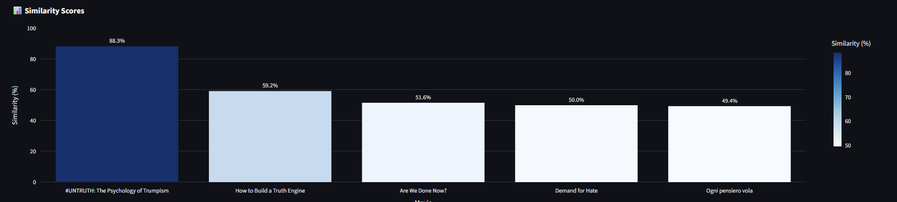

# 🎬 Movie Recommendation System

⚙️ Workflow
1. Data Scraping
   
    - Uses Selenium to scrape IMDb 2024 movie data.
    - Extracted fields:
        - Movie Name
        - Storyline (Plot Summary)
    - Data is stored in IMDB_Movies_Data.csv with columns:
        - Movie Name
        - Storyline

2. Data Cleaning & Preprocessing

    - Remove stopwords, punctuation, and special characters.
    - Tokenize text for analysis.
    - Convert text to vectors using all-MiniLM-L6-v2 (SentenceTransformers) or Count Vectorizer.
  
3. Analysis

    - Apply Cosine Similarity to measure similarity between movie storylines.
    - Rank movies by similarity score.

📊 Streamlit Dashboard

   Upload IMDB_Movies_Data.csv into the app. Explore:
    - Enter a movie storyline or text query. 
    - Get the Top 5 most similar movies (based on storyline).
    - View results with both movie name and storyline.

## ▶️ Running the App

Ensure Python 3.8+ is installed.

1. Clone the repo:

       git clone https://github.com/Arjun-Karthik/Movie_Recommendation_System.git
       cd Movie_Recommendation_System

2.Install dependencies

       pip install -r requirements.txt

3. Run Streamlit app

       streamlit run app.py

4. Upload the Storyline/Plot.

## 🧩 Features

   - Storyline-based movie recommendations.
   - Cosine Similarity scoring for ranking.
   - Interactive Streamlit UI for input and results.
   - Visualization of recommendations.

## ✅ Requirements

   - pandas
   - numpy
   - selenium
   - nltk
   - tqdm
   - sentence-transformers
   - scikit-learn
   - faiss-cpu
   - streamlit
   - plotly

Install all with:

       pip install -r requirements.txt

## 📸 Screenshots

### Overview

### 📊 Distribution of Movie Ratings

## 🎥 Demo Video

   <a href="https://www.linkedin.com/posts/arjun-t-a51383200_imdb-movie-dashboard-app-activity-7348370456242003969-Nd0G?utm_source=share&utm_medium=member_desktop&rcm=ACoAADNQBh0BQsEphYCjQb01l17Z8-pUyINZuxs">IMDb Movie Recommendation System Demo Video</a>

## 📃 License

   This project is licensed under the MIT License – see the LICENSE file for details.
